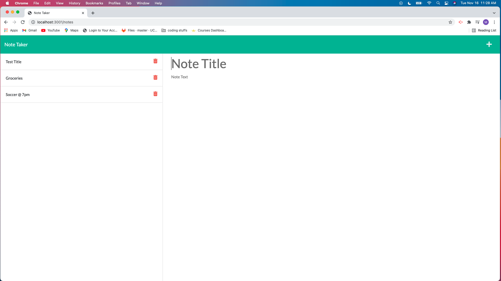

# Note_Taker
Given starter code, create the back-end using Express.js to create and save notes.

## Description
This application uses Express.js to build a notetaker that takes users' input and stores them. Please see live deployment with Heroku below 

## How it works
1. Click the link to the live application below.  
2. Click "Get Started."  
3. Enter a title for the note.  
4. Enter text describing your note.  
5. Click the save icon in the top right corner.   
6. Reload the page and the app should have saved your notes. 
    

Repository: https://github.com/MCassandra/Note_Taker   

Live app: https://evening-brushlands-05589.herokuapp.com/
